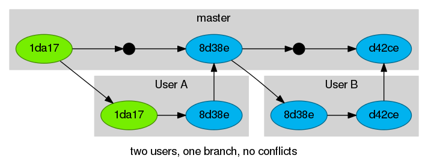
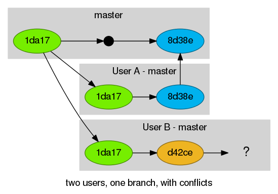
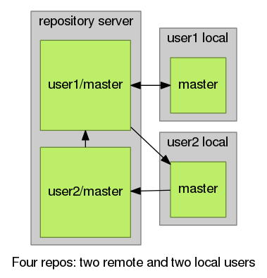
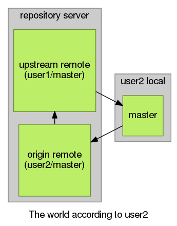

#Next Level git
Follow Along: http://eosrei.github.io/talk-git2

Source: https://github.com/eosrei/talk-git2

Press *spacebar* to continue.


#About Us
Brad Erickson (eosrei) & Mark Ferree (mrf)

#git History

A distributed version-control system created in 2005 by Linus Torvalds for
Linux kernel development when no existing options provided the required features.

When asked why he called the new software, "git", British slang meaning "a
rotten person", he said. "I'm an egotistical bastard, so I name all my projects
after myself. First Linux, now git."

#Prerequisites

##Git Commands

*Working knowledge of Git from the command line.* You must know
the following commands and their usage:

* clone
* checkout
* add
* commit
* push
* pull

##Glossary

* VCS - Version-Control System
* commit
* repo / repository
* tag
* branch

----------

##Useful commands: Tagging commits

Like most VCSs, Git has the ability to tag specific points in history as being important.

Tags are generally used to denote a version release of the codebase or repository.

```bash
user@server ~/development/project $ git tag
user@server ~/development/project $ git tag v1.0
user@server ~/development/project $ git tag
v1.0
user@server ~/development/project $ git show v1.0
commit 1da177e4c3f41524e886b7f1b8a0c1fc7321cac2
Author: Example <user@example.com>
Date:   Tue Jan 19 03:14:08 2038 0000
    Initial git repository build.
```

Think of tags as “Commit Names”

##Useful commands: Comparing differences

git diff shows the differences between commits, the stage, or your current working directory.

Often used to see what’s been changed since the last commit.
```diff
diff --git a/daemon.go b/daemon.go
index d3d57ae..f1ef55c 100644
--- a/daemon.go
+++ b/daemon.go
@@ -179,12 +180,19 @@ func (cli *DaemonCli) CmdDaemon(args ...string) error {

  logrus.SetFormatter(&logrus.TextFormatter{TimestampFormat: timeutils.RFC3339NanoFixed})

+  if len(cli.LogConfig.Config) > 0 {
+    if err := logger.ValidateLogOpts(cli.LogConfig.Type, cli.LogConfig.Config); err != nil {
+      logrus.Fatalf("Failed to set log opts: %v", err)
+    }
+  }
+
  var pfile *pidfile.PIDFile
  if cli.Pidfile != "" {
    pf, err := pidfile.New(cli.Pidfile)
    if err != nil {
      logrus.Fatalf("Error starting daemon: %v", err)
    }
```

##Useful commands: Viewing changes in commit history
```bash
user@server $ git log -p
```

```diff
commit a1f3028a87741bc5218373bc9af8a8aaa562b87e (HEAD, origin/master, origin/HEAD, master)
Author: Brad Erickson <user@example.com>
Date:   Thu Oct 22 15:34:34 2015 -0700

    Add custom.css and adjust Makefile to include

diff --git a/Makefile b/Makefile
index e902fc1..76f5a99 100644
--- a/Makefile
+++ b/Makefile
@@ -19,6 +19,7 @@ index.html: index.md
        --no-highlight --variable hlss=zenburn \
+       --css=css/custom.css \
        index.md -o index.html
```
## Useful commands: Shorter history

```bash
user@server $ git log --oneline
```

```bash
0c869ad Adjust pandoc template and Makefile to use highlightjs
0e92680 Add 'make publish' to update the rendered Github pages branch
413d635 Move revealjs download into Makefile
31f2cb0 Updating index.md with current gdocs
```
##Useful commands: Whatchanged

```bash
user@server $ git whatchanged
```

```bash
commit a1f3028a87741bc5218373bc9af8a8aaa562b87e (HEAD, origin/master, origin/HEAD, master)
Author: Brad Erickson <user@example.com>
Date:   Thu Oct 22 15:34:34 2015 -0700

    Add custom.css and adjust Makefile to include

:100644 100644 e902fc1... 76f5a99... M  Makefile
:000000 100644 0000000... 5de960e... A  css/custom.css
```

##Useful commands: Git Blame

Shows who wrote (or at least last edited) each line.

```bash
user@server $ git blame filename.txt
```
```bash
accd5f0c (Dries Buytaert      2001-03-10 11:07:52 +0000  1) <?php
^008612a (Dries Buytaert      2000-05-18 19:51:59 +0000  2)
94e30bf7 (Dries Buytaert      2004-08-21 06:42:38 +0000  3) /**
94e30bf7 (Dries Buytaert      2004-08-21 06:42:38 +0000  4)  * @file
94e30bf7 (Dries Buytaert      2004-08-21 06:42:38 +0000  5)  * The PHP page that serves all page requests on a Drupal installation.
94e30bf7 (Dries Buytaert      2004-08-21 06:42:38 +0000  6)  *
362cade1 (Dries Buytaert      2007-12-26 08:46:48 +0000  7)  * All Drupal code is released under the GNU General Public License.
f434037c (Nathan Haug         2011-10-30 21:05:57 -0700  8)  * See COPYRIGHT.txt and LICENSE.txt files in the "core" directory.
94e30bf7 (Dries Buytaert      2004-08-21 06:42:38 +0000  9)  */
94e30bf7 (Dries Buytaert      2004-08-21 06:42:38 +0000 10)
5e58da00 (Nathaniel Catchpole 2014-06-26 11:47:01 +0100 11) use Drupal\Core\DrupalKernel;
5e58da00 (Nathaniel Catchpole 2014-06-26 11:47:01 +0100 12) use Symfony\Component\HttpFoundation\Request;
8a567823 (Alex Pott           2014-04-25 20:13:44 +0100 13)
95fe74d5 (catch               2015-03-11 08:31:22 +0000 14) $autoloader = require_once 'autoload.php';
5e58da00 (Nathaniel Catchpole 2014-06-26 11:47:01 +0100 15)
90d6fb15 (Alex Pott           2015-06-03 18:06:46 +0100 16) $kernel = new DrupalKernel('prod', $autoloader);
1251cc35 (webchick            2014-06-18 00:07:06 -0700 17)
90d6fb15 (Alex Pott           2015-06-03 18:06:46 +0100 18) $request = Request::createFromGlobals();
90d6fb15 (Alex Pott           2015-06-03 18:06:46 +0100 19) $response = $kernel->handle($request);
90d6fb15 (Alex Pott           2015-06-03 18:06:46 +0100 20) $response->send();

```

##Useful commands: Git Stash

Store your changes and remove them from the working directory. A stash can
re-applied later as needed.

```bash
user@server $ git stash
```

```bash
user@server $ git stash list
stash@{0}: WIP on master: 049d078 added the index file
stash@{1}: WIP on master: c264051 Revert "added file_size"
stash@{2}: WIP on master: 21d80a5 added number to log
```

```bash
user@server $ git stash apply
```

##Useful commands: Amend
```bash
git commit --amend
```
Replace the current commit. Often used for minor updates.

Careful! Don't amend published commits, anything someone else may have pulled.

##Useful commands: Force push
```bash
git push --force
```

Overwrites the remote branch history with your local branch history.

Careful! You can delete your remote branch history with this command or
even the entire repository.

##Useful commands: Bisect

Bisect: Divide into two parts

```bash
git bisect start
git bisect bad 90d6
git bisect good 362c
```

Run through the commit history to find where a change was introduced.
An optimized binary search is more efficient than checking out each commit in
order:
```bash
git checkout 90d6
git checkout 4j3h
git checkout 362c
git checkout 53j2
git checkout 5484
```

Reference: http://webchick.net/node/99

#User Story Time

Using git IRL

----------

##Incorrect git can work

Two users working on one branch.



*Cross your fingers and hope.*

##Failed to push some refs

The error we’ve all seen working like this.
```
To https://server.com/user/example.git
! [rejected]        master -> master (non-fast-forward)
error: failed to push some refs to 'git@server.com/user/example.git'
To prevent you from losing history, non-fast-forward updates were rejected
Merge the remote changes (e.g. 'git pull') before pushing again. See the
'Note about fast-forwards' section of 'git push --help' for details.
```
Git won't be able to push your changes if another user has pushed to the same branch as you.

##What do you do?



##Common solution

```bash
user@server $ git pull # Equal to fetch and merge.
user@server $ git push
```


##Reasons to avoid

* Creates an extra git merge commit
* Introduces greater risk of merge conflicts
* A messy git history makes problems more difficult to track down.

----------

##A Better Solution

All shared work goes into a development branch.


Controlled releases happen off of this branch when it is merged into the Master branch.

Master is preserved for hotfixes

----------

##The Best Solution

Two users work in their own branches, the second branch is rebased, then merged to master when features are complete. *This is the Github/Bitbucket Pull Request workflow.*


#Creating branches

Git branches allow you to separate work on a project into discrete groups of commits.

Ideally name branches descriptively, such as:

*issue#-short_description*

```bash
user@server ~/development/project $ git branch #List local branches
* master
user@server ~/development/project $ git checkout -b 1-readme-details #Create a new branch
Switched to a new branch '1-readme-details'
user@server ~/development/project $ git branch #List local branches
  master
* 1-readme-details
```

#Deleting branches

Branches can be used for new features, temporary tests or quick backups.
```bash
user@server ~/development/project $ git commit -am "Updating readme"
[1-readme-details 5849d9b] Updating readme
 1 file changed, 1 insertion(+), 1 deletion(-)

user@server ~/development/project $ git checkout master
Switched to branch 'master'

user@server ~/development/project $ git branch -d 1-readme-details
error: The branch '1-readme-details' is not fully merged.
If you are sure you want to delete it, run 'git branch -D 1-readme-details'.
user@server ~/development/project $ git branch -D 1-readme-details
Deleted branch 1-readme-details (was 5849d9b).
```
Delete local and remote branches when you are done with them.

#Merging branches

A merge creates a new commit to incorporate changes from other branches. The two branches commit histories are combined into a single history with each commit holding its place in time.
```
git checkout master
git merge develop
```

#Finding branches to clean up

Git keeps track of what is merged and what isn't.
```bash
user@server ~/development/project $ git branch -r --merged
  origin/HEAD -> origin/master
  origin/master

user@server ~/development/project $ git branch -r --no-merged
  origin/20-news-section
  origin/23-user-login

user@server ~/development/project $ git branch --merged
* master

user@server ~/development/project $ git branch --no-merged
```

----------

##Merge conflicts: Creating

If you want them?

```bash
user@server ~/development/project $ git merge macos
Updating c1f5cc2..fc56b58
Fast-forward
 src/ProjectLauncher/LaunchForm.cs | 2 +-
 1 file changed, 1 insertion(+), 1 deletion(-)
```

```bash
user@server ~/development/project $ git merge linux
Auto-merging src/ProjectLauncher/LaunchForm.cs
CONFLICT (content): Merge conflict in src/ProjectLauncher/LaunchForm.cs
Automatic merge failed; fix conflicts and then commit the result.
```

##Merge conflicts: Resolving

```bash
user@server ~/development/project $ git status
On branch master
You have unmerged paths.
  (fix conflicts and run "git commit")

Unmerged paths:
  (use "git add <file>..." to mark resolution)

        both modified:   LaunchForm.cs
```

```patch
using System.Drawing;
using System.Text;
<<<<<<< HEAD
using System.Macos.Forms;
=======
using System.Linux.Forms;
>>>>>>> linux

using EnvDTE;
```

```bash
user@server ~/development/project $ git add LaunchForm.cs
```

----------

##Remotes and forks: Origin Remote
The source repository is called your *origin* remote.

```bash
user@server ~/development/project $ git clone https://github.com/torvalds/linux.git
user@server ~/development/project $ git remote
origin
```

```bash
user@server ~/development/project $ git status
On branch master
Your branch is up-to-date with 'origin/master'.
```


##Remotes and forks: Two users, one remote


Two users can use the same repository as their origin remote.

##Remotes and forks: Two users, two remotes.

User2 forks the project repository creating their own fork.



##Remotes and forks: Origin and Upstream



The world according to user2

* Pull changes from *upstream* into *local/master*
* Pushes changes to *origin*
* Merges to *upstream* or create a Pull Request.

##Remotes and forks: Update your fork

There are changes to the upstream master. How do you bring those changes into your fork’s master branch?

```bash
git remote
git remote add upstream git@github.com:user/project.git
git remote update --prune # Update your remote repo copies and remove deleted branches
git checkout master
git pull upstream master
git push # aka git push origin master
```
Now make your new feature branch or rebase your existing branches.

#Pull requests

A pull request is a request to pull your changes.

Not a feature of Git, but of UI tools such as Github, Bitbucket, and Gitlab.

Create a pull request when you have new commits for a project in a fork and/or branch which should be pulled into the original project.

*”I’ve made some changes! Will you accept them?”*

----------

##Rebase

"REset your git branch BASE commit"

A merge creates a single commit with two parents, creating a non-linear history.

A rebase “replays” the commits from one branch onto another, creating a linear history. Commits for each feature stay together.

The goal: Create a clean history without resolved merge conflicts or dozens of tiny commits.

##Rebasing a feature branch - 1

Remember this?


##Rebasing a feature branch - 2

Rebase to master, then merge to master.

```bash
git checkout FeatureB
git rebase master
git push -f # Force update your remote branch
git checkout master
git merge master # Or create Pull Request
```

##Squashing commits - 1

You push early and often, but that results in a cluttered history.
```bash
user@server ~/development/project $ git log --oneline
bf7d984 Minor readme edit
7fc1195 Readme details
53ddfc4 Minor edit
63df92b Minor edit
7714f34 New feature
286e2e4 Initial
```

Rebase allows you to “squash” those extra commits together.

##Squashing commits - 2

```bash
user@server ~/development/project $ git rebase -i 286e2e4
```
Which opens your default text editor
```
pick 7714f34 New feature
pick 63df92b Minor edit
pick 53ddfc4 Minor edit
pick 7fc1195 Readme details
pick bf7d984 Minor readme edit

# Rebase 286e2e4..bf7d984 onto 286e2e4
#
# Commands:
#  p, pick = use commit
#  r, reword = use commit, but edit the commit message
#  e, edit = use commit, but stop for amending
#  s, squash = use commit, but meld into previous commit
#  f, fixup = like "squash", but discard this commit's log message
#  x, exec = run command (the rest of the line) using shell
#
# These lines can be re-ordered; they are executed from top to bottom.
# If you remove a line here THAT COMMIT WILL BE LOST.
# However, if you remove everything, the rebase will be aborted.
# Note that empty commits are commented out
```

##Squashing commits - 3

Change *pick* to *squash*
```
pick 7714f34 New feature
squash 63df92b Minor edit
squash 53ddfc4 Minor edit
pick 7fc1195 Readme details
squash bf7d984 Minor readme edit
```
Save and exit.

##Squashing commits - 4

git opens the text editor again allowing you amend the commit message of the now combined commits.

```
# This is a combination of 3 commits.
# The first commit's message is:
New feature

# This is the 2nd commit message:

Minor edit

# This is the 3rd commit message:

Minor edit

# Please enter the commit message for your changes. Lines starting
# with '#' will be ignored, and an empty message aborts the commit.
# rebase in progress; onto 286e2e4
# You are currently editing a commit while rebasing branch 'master' on '286e2e4$
#
# Changes to be committed:
#       modified:   site.css
#
```

##Squashing commits - 5
The result: a clean git history ready to merge or used in a pull request.
```bash
user@server ~/development/project $ git log --oneline
bf7d984 Minor readme edit
7fc1195 Readme details
53ddfc4 Minor edit
63df92b Minor edit
7714f34 New feature
286e2e4 Initial
user@server ~/development/project $ git rebase -i 286e2e4
[detached HEAD 859d12b] New feature
 1 file changed, 4 insertions(+)
[detached HEAD d714f67] Readme details
 1 file changed, 3 insertions(+)
Successfully rebased and updated refs/heads/master.
user@server ~/development/project $ git log --oneline
d714f67 Readme details
859d12b New feature
286e2e4 Initial
user@server ~/development/project $
```

##Editing commits with rebase - 1

Editing commits with rebase is functions like amending a commit, but allows you
to work with the entire history.

```bash
user@server ~/development/project $ git rebase -i 286e2e4
```

Your text editor:
```
edit 859d12b New feature
pick d714f67 Readme details

# Rebase 286e2e4..d714f67 onto 286e2e4
#
# Commands:
#  p, pick = use commit
#  r, reword = use commit, but edit the commit message
#  e, edit = use commit, but stop for amending
#  s, squash = use commit, but meld into previous commit
#  f, fixup = like "squash", but discard this commit's log message
#  x, exec = run command (the rest of the line) using shell
```

##Editing commits with rebase - 2

The result of a rebase to simply edit a commit message
```
user@server ~/development/project $ git log --oneline
d714f67 Readme details
859d12b New feature
286e2e4 Initial
user@server ~/development/project $ git rebase -i 286e2e4
Stopped at 859d12bdcfc54fafcb5fbca3bb9ab0da57f4c92a... New feature
You can amend the commit now, with
    git commit --amend
Once you are satisfied with your changes, run
    git rebase --continue
user@server ~/development/project $ git commit --amend
[detached HEAD 0a9c2fe] New feature, more details to message
 1 file changed, 4 insertions(+)
user@server ~/development/project $ git rebase --continue
Successfully rebased and updated refs/heads/master.
user@server ~/development/project $ git log --oneline
7d328c7 Readme details
0a9c2fe New feature, more details to message
286e2e4 Initial
```

#Useful commit messages

##Not this

```bash
git commit -m “css fix”
```
It is not descriptive or useful.

##Yes, this.

The git history explains how the project evolved and why decisions were made.
Git commit messages, just like code comments, should succinctly explain “what”,
but explain *why* in detail.

```
tag: Short explanation of the commit

Longer explanation explaining exactly what's changed and why, whether any
external or private interfaces changed, what bugs were fixed (with bug
tracker reference if applicable) and so forth. Be concise but not too brief.
```

Reference: https://wiki.gnome.org/Git/CommitMessages

#Summary

New git commands: tag, diff, log, whatchanged, blame, remote, stash, rebase, bisect

Plus: Pull Requests, Useful commit messages

#Further Study

* history rewriting for removing passwords and extraneous binary files.
* repository hooks
* Pull Requests are coming to Drupal.org: https://www.youtube.com/watch?v=37zyV2mqDjU
* https://www.atlassian.com/git/tutorials/advanced-overview/

#EOF

**Brad Erickson**  - eosrei.net - github.com/eosrei

**Mark Ferree** - chapterthree.com - github.com/mrf
