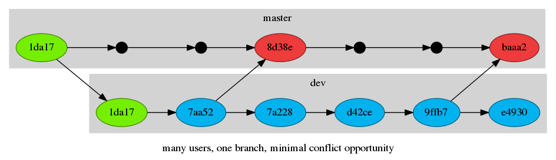
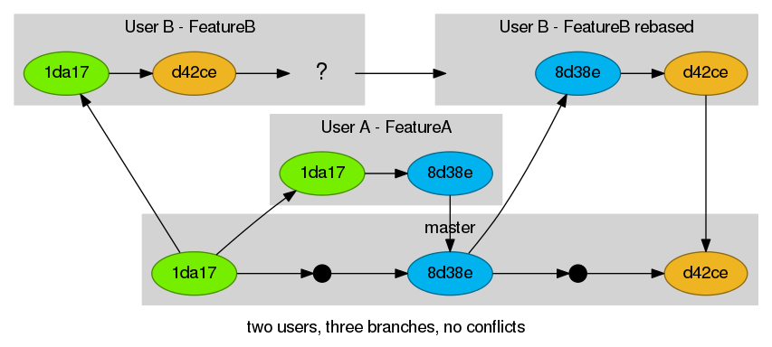

#git, the next level

##About Us
Brad Erickson (eosrei) & Mark Ferree (mrf)

#Prerequisites

##Git Commands

*Working knowledge of Git from the command line.*

You must know the following Git commands and their usage:

* clone
* add
* commit
* push
* pull

##VCS Glossary

* VCS - Version Control System
* commit
* repo / repository
* tag
* branch

#Why is Git better than your VCS?

Many users rarely use git as anything more than a distributed SVN.

Benefits to Git:

* Distributed
    * Local copy of files and complete history
    * Contribute from anywhere even without Internet
* Faster than SVN & CVS
* Integrated with all the tools

----------

##Incorrect git can work

Two users working on one branch.


*Cross your fingers and hope.*

##Failed to push some refs

The error we’ve all seen working like this.
```bash
To https://server.com/user/example.git
! [rejected]        master -> master (non-fast-forward)
error: failed to push some refs to 'git@server.com/user/example.git'
To prevent you from losing history, non-fast-forward updates were rejected
Merge the remote changes (e.g. 'git pull') before pushing again. See the
'Note about fast-forwards' section of 'git push --help' for details.
```
Git won't be able to push your changes if another user has pushed to the same branch as you.

##What do you do?


##Common solution

```bash
user@server $ git pull # Equal to fetch and merge.
user@server $ git push
```


##Reasons to avoid

* Creates an extra git merge commit
* Risk of merge conflicts
* A messy git history <- harder to track down problems

----------

##A Better Solution

All shared work goes into a development branch.



Controlled releases happen off of this branch when it is merged into the Master branch.

Master is preserved for hotfixes

----------

##The Best Solution

Two users work in their own branches, the second branch is rebased, then merged to master when features are complete.

*This is the Github/Bitbucket//etc workflow now and is coming to Drupal.org.*



#Creating branches

SHOW EXAMPLE

```bash
git checkout -b new-branch
git branch
```

#Deleting branches

SHOW EXAMPLE

```bash
git branch -d new-branch
git branch -D new-branch
```

# Useful commands

##Tagging commits

NEEDS EXPLANATION

git tag

GRAPH HERE REPRESENTING TAGS USEFULNESS

##Comparing differences

git diff shows the differences between commits, the stage, or your current working directory.
```bash
git diff
```
SHOW OUTPUT

##Git log
```bash
git log -p
```
SHOW OUTPUT
```bash
git log --oneline
```
SHOW OUTPUT
```bash
git whatchanged
```
SHOW OUTPUT

##Git Blame

Shows who wrote (or at least last edited) each line.

```bash
git blame filename.txt
```
SHOW OUTPUT

#Merging branches

A merge creates a new commit that incorporates changes from other commits. The two different sources commit histories are combined into a single history with each commit holding its place in time.
```
git checkout master
git merge develop
```
#Resolving merge conflicts

Conflicts occur when two commits change the same line of code.

#Simple merge conflict example
TODO

#Complex merge conflict example
TODO

#Messy merge conflict
TODO EXAMPLE

#Feature branch workflows
Summary of how all of the above commands work together

#Multiple remotes and personal forks
git config -l

#Updating your local fork
Never make commits on existing branches
```bash
git remote
git remote add upstream git@github.com:user/project.git
git remote update --prune
git checkout master
git pull upstream master
git push # aka git push origin master
```
Now make your new feature branch or rebase your existing branches

#Pull requests

A pull request is a request to pull your changes.

Not a feature of Git, but of UI tools such as Github, Bitbucket, or soon Drupal.org.

Create a pull request when you have new commits for a project in a fork and/or branch which should be pulled into the original project.

# git rebase

##Explanation

A merge creates a single commit with two parents, leaving a non-linear history, a rebase replays the commits from the current branch onto another, leaving a linear history.

The “base” commit on the branch is changed hence “rebase.”

##Squashing commits with rebase -i
TODO EXAMPLE

##Editing commits with rebase -i
TODO EXAMPLE

#git stash

Stores your current changes.

Can pull back in stashes, and each stash is stored for later recall.

#Rewriting local history
##git commit --amend
Making minor updates to an existing commit
Never to be used on a master branch

##Force push (on your own feature branches)

#Useful commit messages

##Not this

```bash
git commit -m “css fix”
```

##Yes, this.

The git history explains how the project evolved and why decisions were made.

Git commit messages, just like code comments, should succinctly explain “what”, but explain *why* in detail.

```
tag: Short explanation of the commit

Longer explanation explaining exactly what's changed and why, whether any
external or private interfaces changed, what bugs were fixed (with bug
tracker reference if applicable) and so forth. Be concise but not too brief.
```

Reference: https://wiki.gnome.org/Git/CommitMessages

#Summary

#Further Study

* history rewriting for removing passwords and extraneous binary files.
* repository hooks
* Pull Requests are coming to Drupal.org: https://www.youtube.com/watch?v=37zyV2mqDjU
* https://www.atlassian.com/git/tutorials/setting-up-a-repository

#EOF

Brad Erickson
eosrei.net
github.com/eosrei

Mark Ferree
chapterthree.com
github.com/mrf
